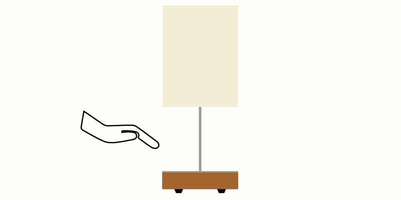
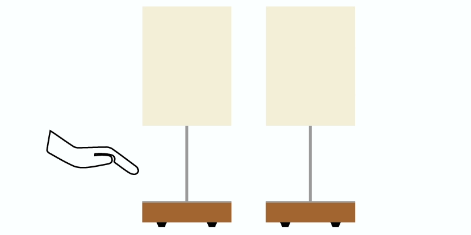
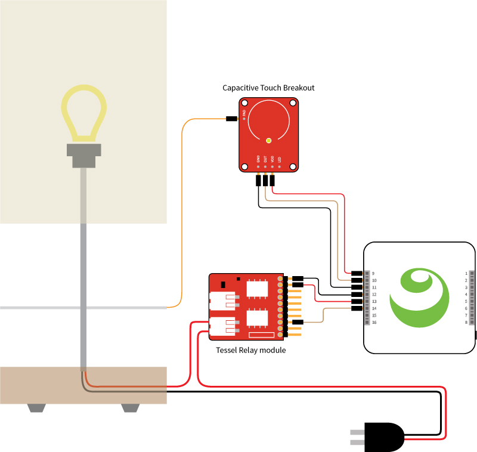
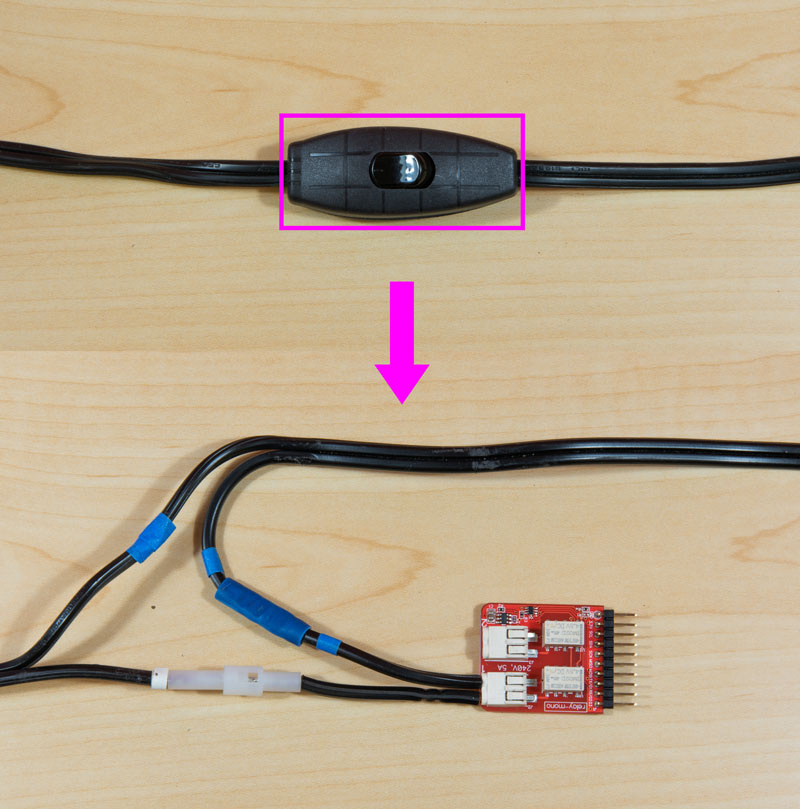
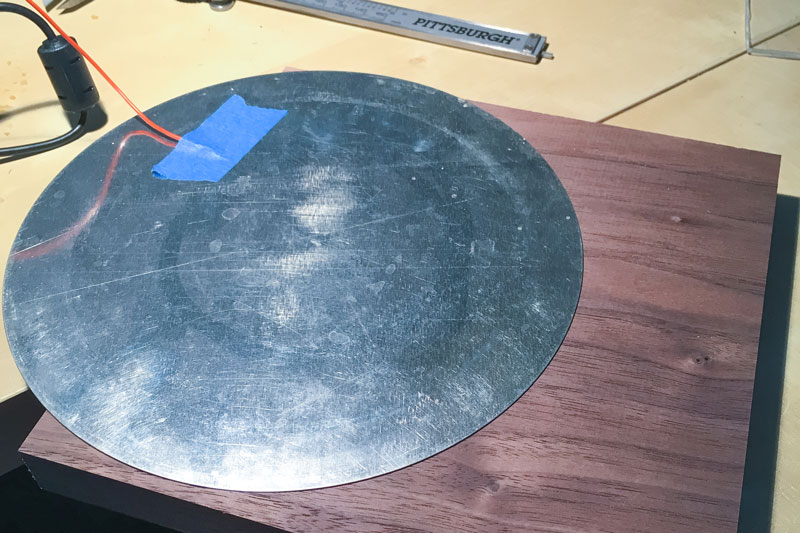
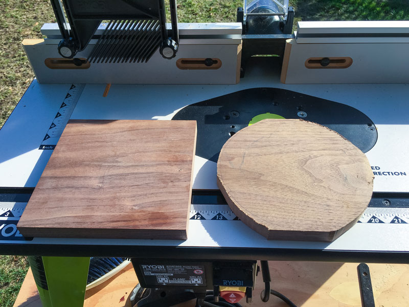
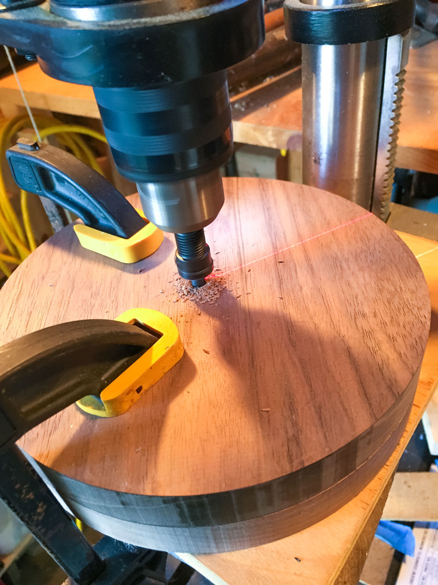
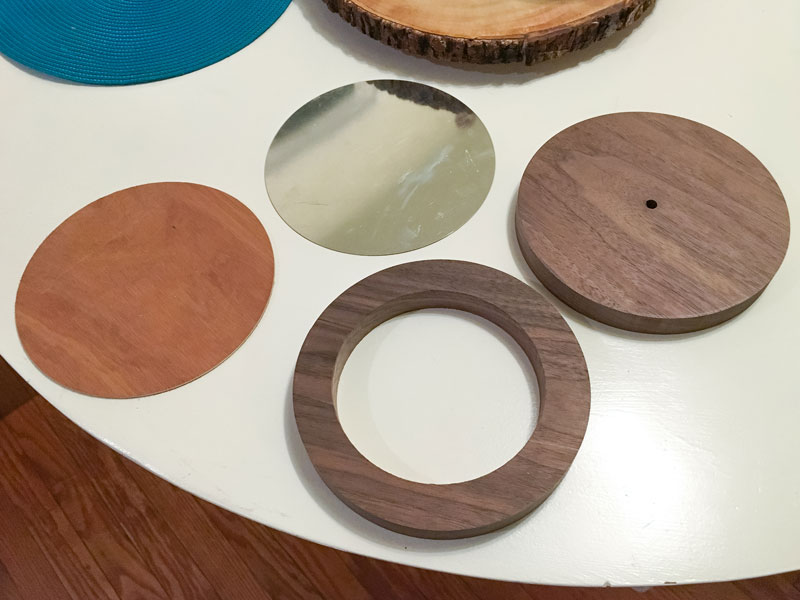
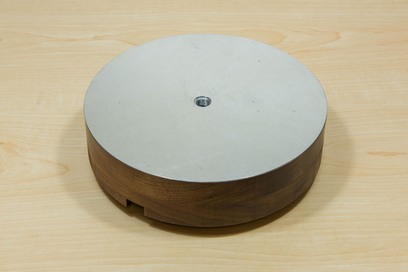
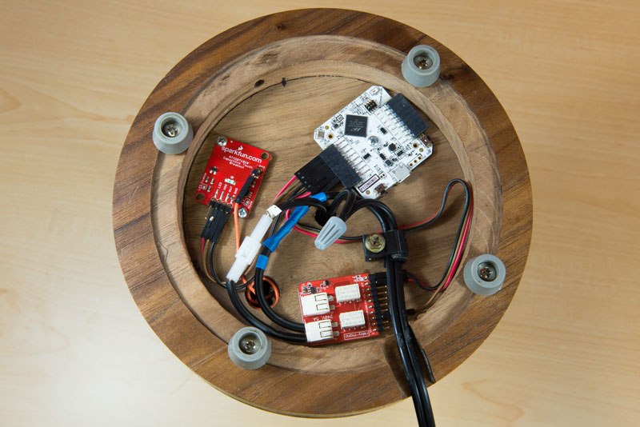

<!-- Version: 160728-LP / Primary author: Lizzie Prader / Last reviewed: July 2016 -->


#Twin Lamps

Create a network of touch-controlled lamps with Kinoma Element, capacitive touch sensors and relays.

---

AT A GLANCE

Project: Twin Lamps

Difficulty: Easy

Time: 3-4 hours

---

#Overview

Kinoma Element can power 3.3V sensors, but some projects call for the use of higher-current devices. The [Tessel Relay module](https://www.seeedstudio.com/item_detail.html?p_id=2309) makes it easy to toggle externally-powered devices on and off. In this project, we control a network of two lamps using Kinoma Element, capacitive touch sensors, and relays.

See a video demonstration of this project [here](https://youtu.be/MntEvaT5JYM).

<!--
<iframe width="700" height="415" src="https://www.youtube.com/embed/MntEvaT5JYM?rel=0&amp;controls=0&amp;showinfo=0" frameborder="0" allowfullscreen></iframe>
-->

## Parts List

The listed parts are for two lamps.

1. Kinoma Element (x2)
2. Table lamp (we used the [MAGNARP from IKEA](http://www.ikea.com/us/en/catalog/products/50242247/)) (x2)
3. [Tessel Relay module](https://www.seeedstudio.com/item_detail.html?p_id=2309) (x2)
4. [Capacitive Touch Breakout](https://www.sparkfun.com/products/12041) (x2)
5. [Pin Headers]()
6. [M2F Jumper Wires]()

##1 Touch modes

The sample app includes two touch modes.

A **short touch** (less than 2 seconds) will toggle a single lamp on and off.



A **long touch** on either one will turn both lamps on/off.



##2 Wiring

The relay is used to open and close the circuit of the lamp. The PAD pin on the capacitive touch sensor is attached to a metal plate, which makes the base of the lamp act as an external electrode.



You'll need to disassemble the lamp cord that is usually plugged into a wall outlet. Cut the end off of the power wire, strip the ends, and insert the two exposed ends into the port on the relay. Pressing down on the connectors with a ballpoint pen is helpful when inserting and removing the wires.



##3 Scripting

In the application's `onLaunch` function, we use the [Pins module](http://kinoma.com/develop/documentation/element-pins-module/) to set up the hardware and connection to the other lamp. This is done in four parts:

1. A call to `Pins.configure` to set up the connection to the pins on the local device. This is where the pin numbering and types are specified. It is also where we specify which [BLL](http://kinoma.com/develop/documentation/element-bll/) each sensor requires; because we only need simple `read` and `write` functions, we use the built-in Digital BLL.

```
Pins.configure({	
	TouchSensor: {
		require: "Digital",
		pins:{
			power: { pin: 9, type: "Power" },
			digital: { pin: 10, direction: "input" },
			ground: { pin: 11, type: "Ground" },
			ground2: { pin: 15, type: "Ground" },
		}
	},
	Relay: {
		require: "Digital",
		pins:{
			ground: { pin: 12, type: "Ground" },
			power: { pin: 13, type: "Power" },
			digital: { pin:14, direction: "ouput" },	
		}
	},
}, ..
```

2. A call to the relay's BLL to toggle the switch on using `Pins.invoke`. This turns the lamp on to signal that everything was configured properly.

```
success=> {
	Pins.invoke("/Relay/write", this.state);
...
```

3. A call to `Pins.share` to make the hardware capabilities of this device accessible to the others on the same network. Here we specify that other devices can connect to this device using WebSockets and request that the shared pins be advertised using ZeroConf.

```
...
	Pins.share({ type: "ws" }, { zeroconf: true, name: this.shareName });
...
```

4. A call to `Pins.discover`, which begins the search for devices being advertised using ZeroConf. The first argument passed into this is a function that is called when a device is discovered. We check the `name` property of the description of the device to make sure it's the twin lamp, and establish the connection to it by calling `Pins.connect`.

```
...
	Pins.discover(connectionDescription => {
		trace("onFound: " + JSON.stringify(connectionDescription) + "\n");
		if(connectionDescription.name.indexOf(this.shareName) != -1){
				this.remote = Pins.connect(connectionDescription);
		}
...
```

The second argument is a function that is called when a device is lost. If it's the other lamp in our network, we remove the reference to the remote device by setting `main.remote` back to `undefined`.

```
	}, connectionDescription => {
		trace("onLost" + JSON.stringify(connectionDescription) + "\n");
		if(connectionDescription.name.indexOf(this.shareName) != -1){
			if (this.remote) this.remote.close();
			this.remote = undefined;
		}
	});
...
```
Once the pins are all set up, we call the `startReading` function. This is where we begin to make repeated calls to the `read` function of the capacitive touch sensor's BLL. The `read` function returns 1 if the sensor is being touched and 0 otherwise.

```		
Pins.repeat("/TouchSensor/read", 100, result => {
	...
```

If the sensor is being touched, we change the state of the local relay and wait for 2 seconds. If the sensor is still being touched, we also change the state of the remote relay to match. In both cases we want to call the `write` function in a relay's BLL; for the local relay we use `Pins.invoke`.

```
Pins.invoke("/Relay/write",  this.state);
```

The reference to the remote device's pins are stored in `main.remote`, but the rest of the call looks identical to the local sensor call.

```
this.remote.invoke("/Relay/write", this.state);
```

If you want to change the length of time that defines a 'long' touch, simply edit the `main.hold` object to the desired value, in milliseconds.

```
var main = {
	...
	hold: 2000, 
```

##4 Setting up the lamp

In order to make this project look more like a real product, we put additional effort into crafting a wooden base that nests all the parts for the lamp.













##5 Finish

Once you've wired everything up, download the [twin-lamps](https://github.com/Kinoma/KPR-examples/tree/master/element-twin-lamps) sample application and open it in Kinoma Code. Run it on both of your Kinoma Elements and tap the touch sensor to switch the lamps on and off.

Keep in mind that you are not limited to creating a network of just two lamps. You can add additional lamps to the network with just a few changes to the code, and the relay can be attached to other devices. Perhaps you want to turn on your coffee machine when you touch your alarm clock, or wirelessly control the fan, speakers and lamp in your room with a touch pad on your desk.

If you need help along the way, please join us on our [forum](http://forum.kinoma.com/)!

#Congratulations!

You now have a network of touch-controlled lamps!